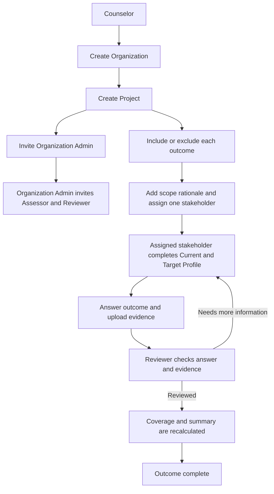

# Outcome Assignment and Reviewer Final Gate

## Goal

Align the v1 assessment workflow with the approved workflow diagram:

- A Counselor defines project scope per outcome, explains the scope decision, and assigns one stakeholder owner.
- The assigned stakeholder completes the Current Profile, Target Profile, response, and evidence.
- A Reviewer performs the response/evidence review and completes the outcome when it passes.

The implementation must keep the existing lean Next.js + Go + PostgreSQL architecture and avoid a separate task-management subsystem.

## Approved workflow



The eligible assignee roles are active `org_admin` and `assessor` users in the same organization. The diagram calls out Assessor as the normal owner; allowing Organization Admin preserves the previously agreed v1 role boundary.

## Role permissions

| Role | Scope and assignment | Current/Target Profile | Response and evidence | Review |
| --- | --- | --- | --- | --- |
| `counselor_admin` / `counselor` | Edit included, rationale, and one assignee per outcome | Read-only | Read-only | Read-only |
| Assigned `org_admin` / `assessor` | Read assigned included outcomes | Edit all Current/Target fields, including Priority and Coverage | Save, submit, upload, delete own evidence | No |
| `reviewer` | Read all included outcomes | Read-only | Read-only | Final review gate |
| `viewer` | Read all included outcomes | Read-only | Read-only | No |

Counselors can still read the complete project, including out-of-scope outcomes, so they can maintain the assessment context. Stakeholder data access is scoped by role and assignment; excluded outcomes never appear in stakeholder profile or response lists.

## Data model

### Profile assignment

Add a nullable `assigned_user_id` foreign key to `project_subcategory_profiles`:

- References `users(id)` with `ON DELETE SET NULL`.
- Must point to an active user whose `organization_id` matches the project organization.
- Must have role `org_admin` or `assessor`.
- Must be null when `included=false`.
- Existing projects remain valid with no assignment until a Counselor configures them.

The existing profile fields remain the source of truth for Current Profile and Target Profile. Stakeholders own those fields; Counselors only read them.

## API design

### Profile read and update

The existing profile endpoints remain the main interface:

- `GET /api/projects/:projectID/profile` returns `assignedUserID`, assignee name, and assignee email where available.
- `PUT /api/projects/:projectID/profile/:subcategoryID` accepts scope/assignment fields and profile fields, but the server validates the allowed fields by role.

Counselor patch fields:

- `included`
- `rationale`
- `assignedUserID`

Assigned stakeholder patch fields:

- Current priority, coverage, activities, and policies.
- Target priority, coverage, and approach.
- Notes and considerations.

Stakeholders cannot modify `included`, `rationale`, or `assignedUserID`. A scope change and assignment are validated as one logical update: an included outcome must have an eligible assignee, and an excluded outcome clears its assignment.

The existing organization users endpoint supplies the assignee options. The Counselor UI filters it to active `org_admin` and `assessor` users; the API repeats the validation and never trusts the client-side filter.

### Response and evidence authorization

Existing response and evidence endpoints remain in place, with assignment checks added:

- Only the assigned stakeholder can save, submit, upload, or delete evidence for an outcome.
- Reviewer can read included outcomes and perform the final review gate.
- Counselor can read response/evidence data but cannot edit the stakeholder response.
- Reviewer review sets `status=reviewed`, which completes the outcome.
- Reviewer can return the response to `needs_more_info` when more work is required.
- The summary remains derived from saved profile data, so no separate summary write or background job is introduced.

## Frontend design

### Counselor assessment card

Each outcome card shows a compact scope section with:

- Include in project checkbox.
- Scope rationale input.
- Responsible stakeholder select, limited to active Organization Admins and Assessors.

Current/Target fields are visible for context but disabled for Counselors. The card shows the Reviewer status; `Reviewed` completes the outcome and `Needs more information` returns it to the assigned stakeholder.

### Stakeholder assessment card

The assigned stakeholder sees only their included outcomes. The scope controls are hidden or read-only. Current Profile, Target Profile, Priority, Coverage, response, and evidence controls are editable according to the existing draft/submitted/review lifecycle.

### Reviewer and Viewer cards

Reviewer sees all included outcomes and the first-review controls. Viewer sees included outcomes without mutation controls. Neither role can change scope, assignment, Current/Target Profile, or evidence.

## State transitions

```text
Stakeholder: draft -> submitted
Reviewer: submitted -> reviewed | needs_more_info
Stakeholder after needs_more_info: edit -> submit
```

When a stakeholder resubmits after `needs_more_info`, Reviewer review is required again.

## Error handling

- Reject assignment to an inactive user, a user from another organization, or a role other than `org_admin`/`assessor` with a validation error.
- Reject an included outcome without an assignee.
- Reject stakeholder profile or response updates for an outcome not assigned to the current user.
- Keep the form open and display API errors inline; do not silently discard unsaved fields.

## Testing

- Migration and store tests cover assignment persistence, organization/role validation, and clearing assignment when an outcome is excluded.
- API tests cover Counselor scope updates, assigned stakeholder profile updates, unauthorized stakeholder updates, and Reviewer transitions.
- Frontend tests cover the Counselor scope/assignee controls, stakeholder Current/Target editing, role-based visibility, and Reviewer actions.
- Existing Go tests, frontend tests, typecheck, and production Docker build must remain green.

## Non-goals

- Multiple assignees per outcome.
- Email notifications or task reminders.
- Separate task tables, calendars, or workflow automation.
- Changing the existing invitation acceptance flow.
